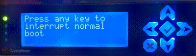

# CFA - interfaces with CrystalFontz USB LCDs

Known to work with CFA631 and CFA635 LCDs; likely to work with others since the command sets have a lot in common. Your kernel will need the appropriate driver(s) - CDC ACM for newer LCDs, usb-serial for older.

### Known issues
Some tests are occasionally flaky, and the test code is rather ugly. I wasn't sure how to fix the ugliness short of removing tests, which doesn't strike me as the best of options.

## Upstream

This is the cfa package that's part of https://github.com/purecloudlabs/gprovision, specifically
https://github.com/purecloudlabs/gprovision/tree/master/gopath/src/gprovision/pkg/hw/cfa .

I am duplicating it here to re-write import paths so it's easier to use standalone.
